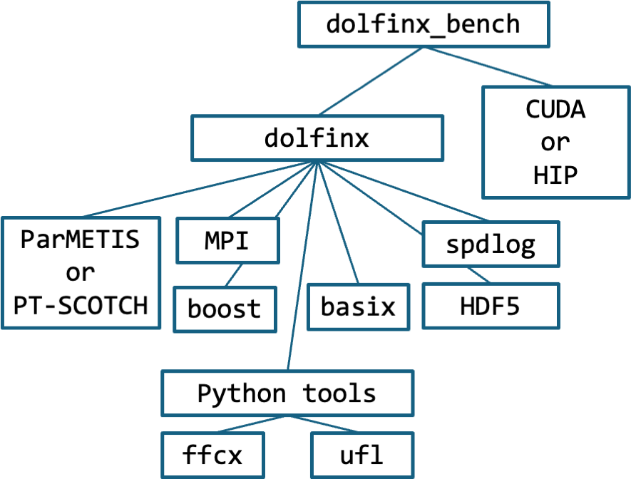

# UK NSS DOLFINx Benchmark

**Important:** Please do not contact the benchmark maintainers directly with any questions.
All questions on the benchmark must be submitted via the procurement response mechanism.

The DOLFINx Benchmark is a performance benchmark for testing
matrix-free Finite Element operator evaluation on unstructured
hexahedral grids. It is available at
[https://github.com/ukri-bench/benchmark-dolfinx] with an MIT license.

For a given set of parameters, DOLFINx Benchmark constructs a mesh
with a fixed number of degrees-of-freedom (DoFs) per MPI rank. The
DoFs are initialised from data on the CPU, and transferred to
GPU as a vector `b`. There is one GPU per MPI rank. On the GPU, one of the following
two operations is performed repeatedly for a number of repetitions:

- Operator Action: computes the matrix-free operation `y=A.b`
- Conjugate Gradient iteration: Operator Action *plus* axpy and global reduce operations.

Each operator iteration involves an overlapped computation-communication round
as follows:

- Scatter halo data to neighbors
- Compute GPU kernel on local cells
- Unpack received halo data
- Compute GPU kernel on halo cells

The main parameters are: Number of DoFs per GPU (`ndofs`) (range 1000-100000000+), Polynomial
degree (`degree`) (range 2-7), Floating-point precision (`float`)
(32/64). The maximum `ndofs` will be determined by the GPU memory
size, but should be at least 60 million.

## Status

Stable

## Maintainers

- Chris Richardson
- Garth Wells

## Overview

### Software

[https://github.com/ukri-bench/benchmark-dolfinx](https://github.com/ukri-bench/benchmark-dolfinx)



### Architectures

- CPU: x86, Arm
- GPU: NVIDIA, AMD

### Languages and programming models

- Programming languages: C++
- Parallel models: MPI
- Accelerator offload models: CUDA, HIP

## Building the benchmark

**Important:** All results submitted should be based on the following
  repository commits:

#### Benchmark repository

- benchmark-dolfinx repository:
  [893667c](https://github.com/ukri-bench/benchmark-dolfinx/commit/893667c40afa6613b5560e5c02de333b06054cc1)

#### Core FEniCS repositories

- dolfinx repository: *tag v0.10.0.post4* [ac47595](https://github.com/FEniCS/dolfinx/commit/ac47595b23119b1e8ef45c7cdd9b2f085772d63c)
- ffcx repository: *tag v0.10.1.post0* [009c0e7](https://github.com/FEniCS/ffcx/commit/009c0e75776314689be039b19eeffad6a1a2817f)
- basix repository: *tag v0.10.0.post0* [433fb7f](https://github.com/FEniCS/basix/commit/433fb7f60f8511e16bcbb403870867d20a69fb4a)
- ufl repository: *tag 2025.2.0* [a53832a](https://github.com/FEniCS/ufl/commit/a53832a7700af019d369406db5fc5e7c2b4311c2)

### Permitted modifications

#### Baseline build

- `benchmark-dolfinx` has been written with standard C++20 and tested with ROCm 6.3.4 and CUDA
12.9. Modifications for later versions of ROCm and CUDA are permitted,
if required to resolve unavoidable compilation or runtime errors.

### Requirements

- The host-code compiler must support C++20 including
`std::format`. This limits the choice of host-code compilers to
reasonably recent versions (gcc-13 or later).
- For NVIDIA GPUs, CUDA version 12.x is recommended.
- For AMD GPUs, ROCm version 6.x is recommended.

### Manual build

Detailed build instructions can be found in the benchmark source
code at:

- [https://github.com/ukri-bench/benchmark-dolfinx/blob/main/README.md].

The following configurations have been tested using the `spack`
installation method described in the repository:

- [LUMI-G](https://docs.lumi-supercomputer.eu/hardware/lumig/): ROCm
  6.3.4, GCC 14.3.0, HPE Cray MPICH 8.1.32
- [CSD3](https://www.csd3.cam.ac.uk/): CUDA 12.9.1, GCC 13.4.0,
  OpenMPI 4.1.1+CUDA
- [Isambard](https://docs.isambard.ac.uk/) CUDA 12.9.0, GCC 14.3.0, HPE Cray MPICH 8.1.32

## Running the benchmark

The benchmark is designed to run on GPU, but does not do automatic
allocation of devices. For example, if there are multiple GPUs on the
same host, they must be presented individually with a "gpu_select"
script, when running in parallel with MPI. For example:
```
#!/bin/bash
export CUDA_VISIBLE_DEVICES=$OMPI_COMM_WORLD_LOCAL_RANK
exec $*
```
and then `mpirun -n 64 ./gpu_select bench_dolfinx ...`
On nodes with multiple GPUs there will also be NUMA effects,
so correct binding of CPUs to MPI processes is also important.
GPU-aware MPI is required for transfer between devices.

### Command-line arguments

Command line arguments can be shown with the `-h` option.
For benchmarking purposes, use the following options:

- Correctness comparison with matrix result: `bench_dolfinx --mat_comp
  --ndofs_global=100000 --degree=3 --json mat_comp.json`
- Throughput at Q3, 10M degrees-of-freedom: `bench_dolfinx --degree=3
  --ndofs=10000000 --json Q3-10M.json`
- Throughput at Q6, 10M degrees-of-freedom: `bench_dolfinx --degree=6
  --ndofs=10000000 --json Q6-10M.json`
- Throughput at Q3, 60M degrees-of-freedom: `bench_dolfinx --degree=3
  --ndofs=60000000 --json Q3-60M.json`
- Throughput at Q6, 60M degrees-of-freedom: `bench_dolfinx --degree=6
  --ndofs=60000000 --json Q6-60M.json`

The matrix comparison should be run on 1 GPU and 4 GPUs with the same
output (within numerical roundoff precision). This is a *PASS/FAIL* test.
The throughput tests can in principle be run on any number of GPU/GCD
devices. The *Figure of Merit* is the "data throughput" measured in
GDoFs/s, which is reported at the end of each run, and also saved to
the JSON files.
Some baseline data is shown below.

### LUMI-G (MI250x): Throughput in GDoFs/s for 1-16 nodes (8-128 GCDs)

|Operation|1|2|4|8|16|
|---------|-|-|-|-|--|
|Q3 1M|17.328|33.2159|58.6681|114.966|225.56|
|Q6 1M|21.1168|38.4989|51.486|73.6816|195.58|
|Q3 10M|18.9448|36.0356|67.4767|137.571|262.282|
|Q6 10M|26.5277|50.4899|94.0343|142.381|371.053|
|Q3 60M|19.6491|38.9419|73.6595|147.589|299.465|
|Q6 60M|28.0689|55.0029|103.26|197.221|415.822|
